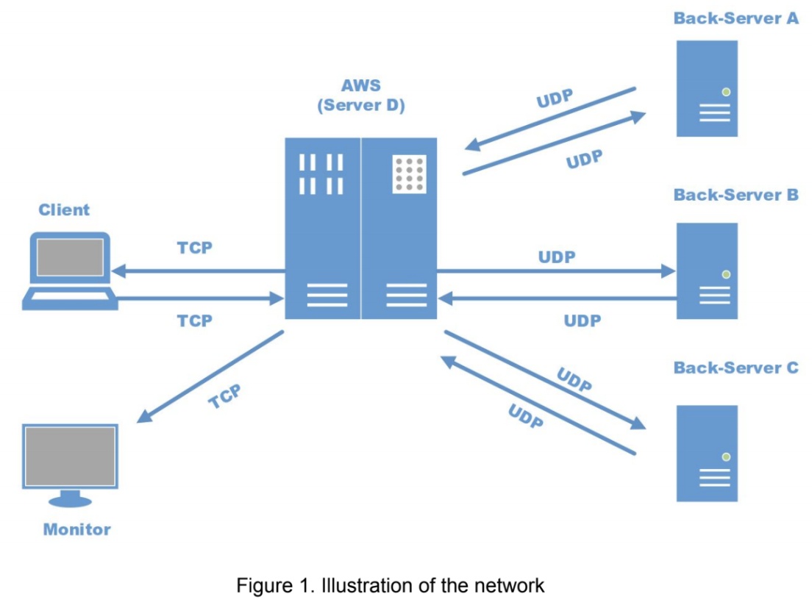

## Distributed Lookup Service
#### April 2018
#### Description: 
Socket programming project to simulate a simplified version of a distributed lookup service. The project is written is C++ and simulates a DLS model where a single client issues a key search to a server which in turn searches for the key over 3 backend servers. The server then collects the results from the backend servers, performs additional computation on the results, and communicates to the client in the required format.



The client functionality has three functions. 
1. Search > Returns exact matches to client and returns exact matches and one edit distance matches to the monitor
2. Prefix > Returns matches with given prefix
3. Suffix > Returns matches with given suffix

#### Usage:
Making Executables
```bash
make all
```
Server and Monitor Setup
```bash
make serverA
make serverB
make serverC
make aws
make monitor
```
Client Usage
```bash
./client <function> <input>
# Search
./client search muggle
# Prefix
./client prefix sub
# Suffix 
./client suffix ing
```

#### Sources:

**"Beej's Guide to C Programming and Network Programming (socket programming)"**

> 	- Section 6: Client-Server Background
> 		- 6.1. A Simple Stream Server (Used for reference in aws)
> 		- 6.2. A Simple Stream Client (Used for reference in client, aws)
> 		- 6.3. Datagram Sockets (Used for reference in aws, serverA, serverB, serverC)
> 	- Section 9: Man Pages (Used for reference in method and function calling)

Overall, I drew the procedure of receiving and sending messages by TCP or UDP from this guide. I read over it in depth and used the information to form a working network of servers and clients. Functions include a wide array over all files such as:
	- getaddrinfo(), socket(), bind(), connect(), listen(), accept(), send(), recv(), sendto(), recvfrom(), close()